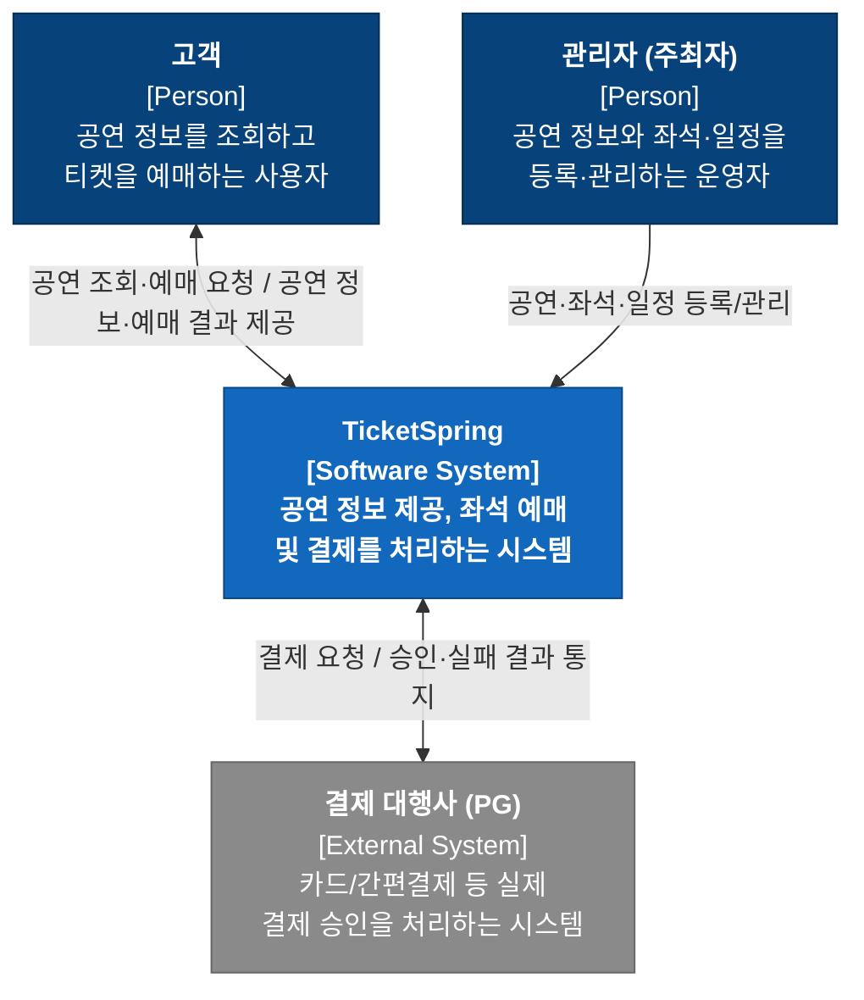

# C4 Model - Level 1: System Context

TicketSpring의 최상위 System Context 다이어그램입니다. 고객, 관리자(주최자), 결제 대행사(PG)와 TicketSpring 시스템 간의 관계를 나타냅니다.

## 구성 요소

| 구분 | 이름 | 책임 |
|---|---|---|
| Person | 고객 | 공연 정보를 조회한다 / 티켓을 예약한다 (좌석 정보, 날짜 등) |
| Person | 관리자 (주최자) | 공연 정보를 등록한다 / 좌석·일정을 관리한다 |
| Software System | TicketSpring | 공연 정보를 조회해서 고객에게 제공한다 / 티켓 예매 및 결제 진행 |
| External System | 결제 대행사 (PG) | 결제 승인을 처리한다 / 결제 결과를 TicketSpring에 통지한다 |
